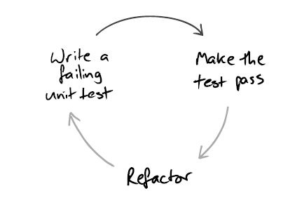
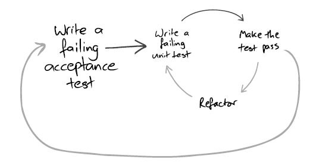

이번 시리즈에서는 인수 테스트 주도 개발을 `개발 관점`으로 접근하여 용어 정리를 하고 예시를 통해 적용하는 방법을 알아보겠습니다.

## TDD

많은 분들이 아시다시피 TDD 사이클은 3단계로 이루어져있습니다.


- 실패하는 테스트 작성하기
- 테스트를 성공시키기
- 리팩터링 하기

TDD 사이클에서 크게 두 가지 중요한 점은 테스트 코드 우선과 리팩터링입니다.
하나는 요구사항을 검증하는 테스트 코드를 먼저 만들어 구현하고자 하는 것을 조금 더 명확히 하는 것이고, 다른 하나는 구현 후 리팩터링을 진행하여 다음 사이클을 대비하고 유지 보수하기 좋은 코드로 유지하게끔 하는 작업을 뒤로 미루지 않게 도와줍니다.
리팩터링에 대해서는 추후 포스팅에서 다루기로 하고 이번에는 테스트 우선에 대해서 조금 더 깊게 이야기해보겠습니다.


## ATDD - 인수 테스트 주도 개발

ATDD는 시나리오 레벨의 구현하고자 하는 대상을 인수 테스트로 정하고 개발을 시작합니다.
대상을 테스트로 정하고 개발에 들어가는 TDD 사이클과 유사하다고 할 수 있습니다.
여기서 인수 테스트는 작은 단위의 모듈이 아닌 기능 시나리오 레벨의 검증을 목적으로 합니다.



인수 테스트 정의가 끝나면, 이 인수 테스트를 성공하게 하기 위해 작은 단위의 TDD 사이클을 반복합니다.
인수 테스트가 성공할 때까지 여러 번의 TDD 사이클이 반복되어 수행되고, 인수 테스트가 성공하면 리팩터링 단계를 거친 후 ATDD 사이클이 끝납니다.

## TDD와 ATDD 비교

엄밀히 따지면 ATDD는 TDD의 여러 종류 중 하나라고 할 수 있습니다. TDD의 T(Test)를 AT(Acceptance Test)로 한정하여 진행합니다.
그러면 굳이 왜 인수 테스트라고 한정 지을까요?
앞서 이야기한 대로 테스트를 인수 테스트로 한정 지으면 테스트로 검증하고자 하는 대상이 작은 단위가 아니라 시나리오 레벨로 정할 수 있습니다.

#### 시나리오 레벨의 검증

기존 TDD는 작은 단위에 대한 검증에는 뛰어나지만, 각각을 구현한 후 전체 영역이 잘 동작하는지 확인할 때 의도와 다른 경우가 종종 있습니다.
이때 전체 영역을 커버할 수 있는 인수 테스트를 먼저 작성하고 이 인수 테스트를 성공시키기 위해 TDD 사이클을 반복한다면 뚜렷한 방향성을 가지고 개발을 진행할 수 있습니다.

#### 자연스럽게 다음 TDD 사이클로 이어지기

TDD를 이용하여 코드를 작성해 나갈 때 TDD 사이클을 유지하는 게 생각보다 어렵습니다.
테스트 작성 후 기능 구현하고 리팩터링을 한 뒤 다음을 어떤 걸 구현해야 할지 막막했던 경험이 생각이 나네요.
생각해보면 TDD는 단순한 규칙을 가지고 있습니다. 그래서 그런지 작은 단위의 기능을 구현하다 보면 내가 뭐를 구현하기 위해서 이 기능을 만들고 있지? 라는 생각이 들 때도 있습니다.
인수 테스트를 먼저 작성하여 전체적인 기능과 시나리오에 대한 이해를 명시적으로 선언한 뒤 개발을 진행한다면, 이후 한참 개발을 진행하다가도 이 인수 테스트를 통해 다시 한번 작업의 방향성을 확인할 수 있습니다.

## 인수 테스트, 너무 번거로운 거 아닌가?

인수 테스트(Acceptance Test)는 사용자 인수 테스트(User Acceptance Test)로 많이 불립니다.
사용자 인수 테스트는 말 그대로 `요구사항을 사용자가 직접 검증하여 개발이 완료되었음을 증명하는 테스트`입니다.
사용자가 직접 검증하기 위해서는 내부적인 코드를 활용할 수 없고 실제 서비스를 사용하는 방법과 유사하게 테스트가 진행되어야 합니다.
구체적인 기술(개발 방법)을 몰라도 요구사항 베이스에서 진행할 수 있어야 하죠.
예를 들면 브라우저나 디바이스를 통해 사용자의 Interaction(UI)부터 시작하여 전체 사이클을 검증할 수 있어야 합니다.
즉, UI부터 전체 기능이 정상적으로 동작하는지 확인할 수 있어야 합니다.

사용자 인수 테스트를 자동화하려면 (엄청나게) 큰 노력과 리소스가 필요할 수 있습니다.
그 테스트의 효과는 좋을 수 있겠지만, 테스트를 구성하고 유지보수를 하려면 그만큼 TDD의 허들이 높아집니다.

## 테스트 시나리오의 품질 관리

구체적인 행위를 검증하기보다는 비즈니스 규칙을 검증해야 테스트 시나리오의 품질을 관리하는 데 유리합니다.
상대적으로 비즈니스 규칙보다는 구체적인 행위의 변경이 빈번하게 일어나기 때문이죠.
> 


백엔드 개발 시 앞서 이야기한 방법처럼 UI 기반 인수 테스트를 작성하기 위해서는 구체적인 행위를 검증할 수 있어야 합니다.
따라서 UI를 포함한 전체 레벨의 테스트를 하는 것은 큰 부담입니다.

ex) selenium을 활용한 UI 테스트 예시
```java
import org.openqa.selenium.By;
import org.openqa.selenium.Keys;
import org.openqa.selenium.WebDriver;
import org.openqa.selenium.WebElement;
import org.openqa.selenium.firefox.FirefoxDriver;
import org.openqa.selenium.support.ui.WebDriverWait;
import static org.openqa.selenium.support.ui.ExpectedConditions.presenceOfElementLocated;
import java.time.Duration;
public class HelloSelenium {
    public static void main(String[] args) {
        WebDriver driver = new FirefoxDriver();
        WebDriverWait wait = new WebDriverWait(driver, Duration.ofSeconds(10));
        try {
            driver.get("https://google.com/ncr");
            driver.findElement(By.name("q")).sendKeys("cheese" + Keys.ENTER);
            WebElement firstResult = wait.until(presenceOfElementLocated(By.cssSelector("h3>div")));
            System.out.println(firstResult.getAttribute("textContent"));
        } finally {
            driver.quit();
        }
    }
}
```

## API 레벨 인수 테스트
아무리 좋은 방법이라 하더라도 실무에 적용하기 힘들정도로 번거롭고 품질관리하기 어려우면 현실적으로 사용하기가 어렵습니다.
실무에서 ATDD를 통해 개발하기 위해서는 최대한 허들을 낮추어 많이 활용될 수 있도록 노력해야 합니다.

저는 UI 레벨에서의 인수 테스트가 아닌 API 레벨로 인수 테스트를 하는 것을 추천합니다.
인수 테스트를 위한 시나리오를 작성하고 이를 검증하는 인수 테스트를 API 레벨에서 만든 뒤 이를 구현하는 방법으로 진행하면 조금 수월하게 ATDD 사이클을 유지할 수 있습니다.

다음 포스팅에서 API 레벨의 인수 테스트 주도 개발 예시를 다루어보겠습니다.
